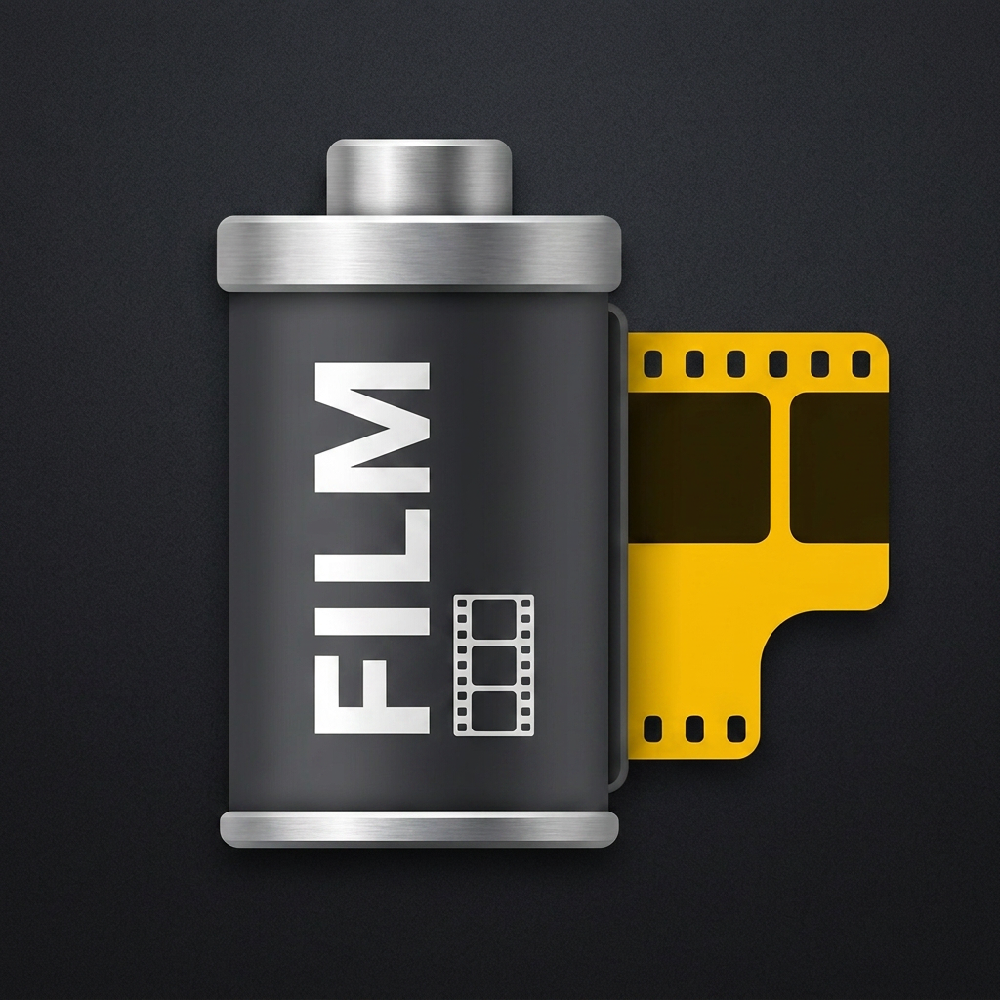
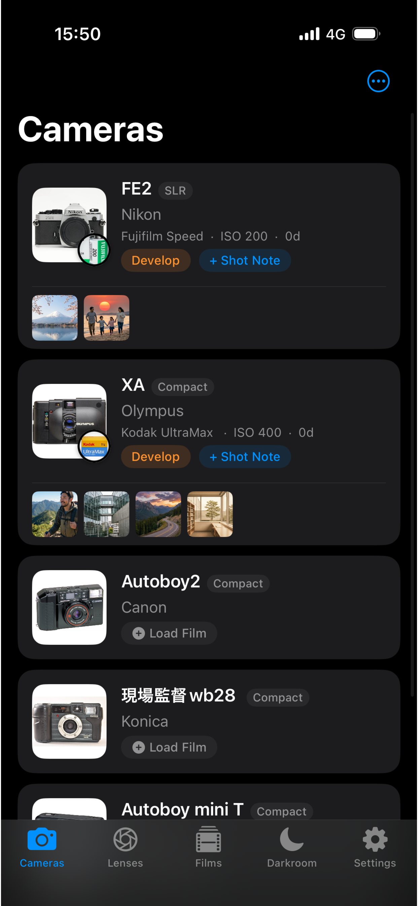
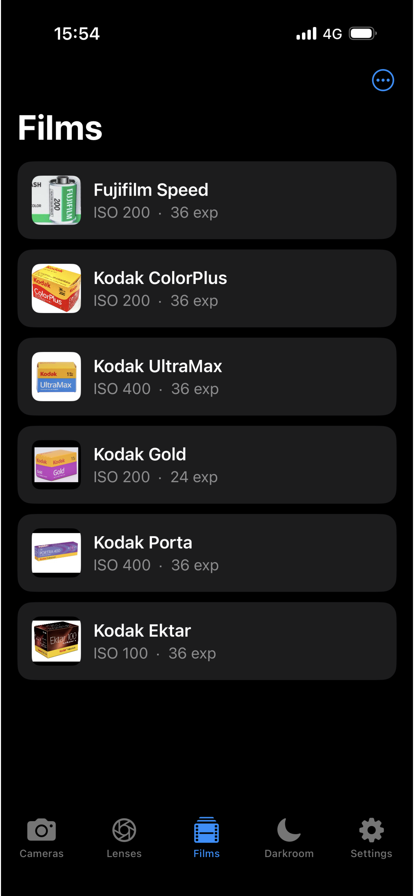
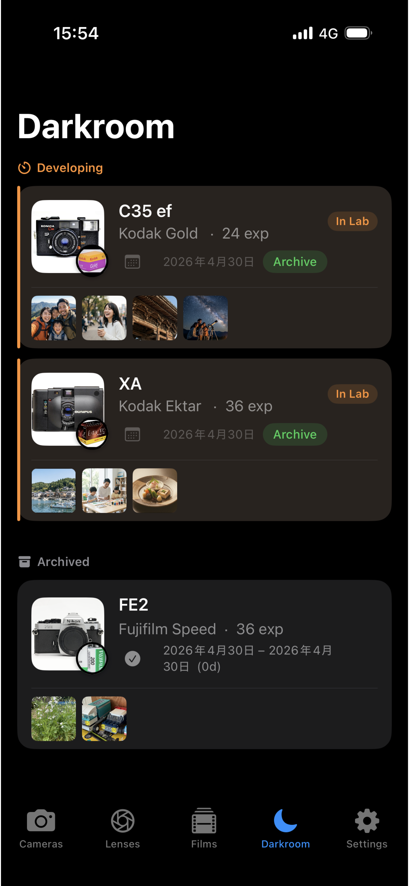
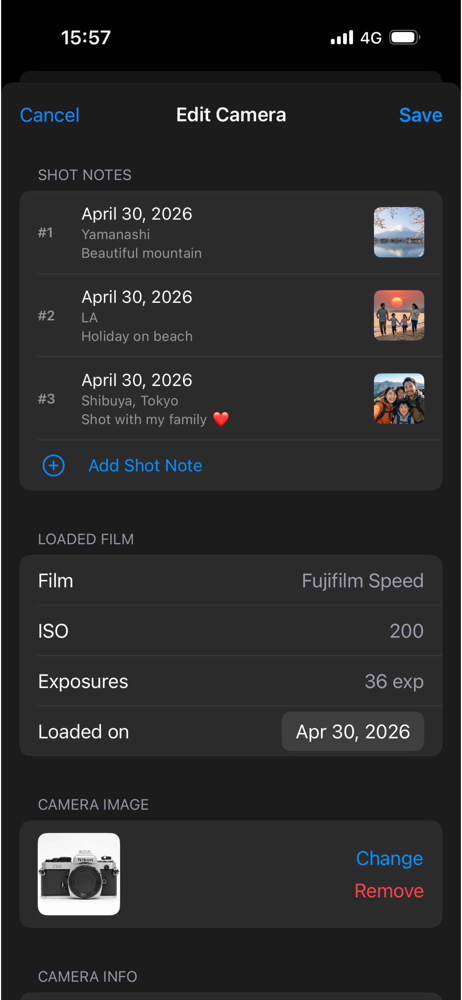
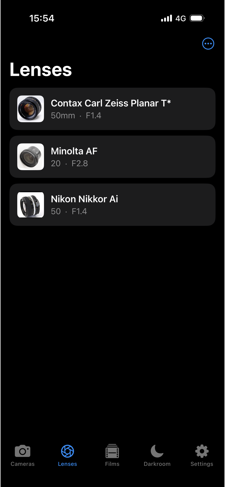

  
  <h1 style="margin:0;">Patora</h1>
  
Film Camera Logbook &amp; Manager

  <!-- Replace href with your App Store link -->
  

---

## Overview

Do you know which film is loaded in which camera?

**Patora** is the film photography management app for everyone who shoots on film. Track your cameras, film rolls, and shots — all in one place, without interrupting your analog experience. Automatic iCloud sync keeps everything backed up and in sync across all your Apple devices.

---

## Screenshots

  
  
  
  
  

---

## Features

### 📷 Camera Management
Register your cameras and see their loaded status at a glance. Store a photo and camera info for every body you own.

### 🎞 Film Workflow
Track rolls from **Loaded → Developing → Archived** in three simple steps. When your prints come back from the lab, one tap sends them to the archive.

### 📝 Shot Logging
Record frame number, date, location (auto GPS), and lens for every shot. Attach up to 4 reference photos per frame.

### 🔭 Lens Library
Save your favorite lenses as presets for quick selection. Perfect for SLR and rangefinder shooters who swap glass often.

### 🗂 Film Database
Pre-register your go-to film stocks — Kodak, Fujifilm, ILFORD, and more — for fast roll loading.

### ☁️ iCloud Sync
Automatic backup and sync across all your Apple devices. Switch phones and pick up right where you left off.

---

## How to Use

1. **Add your cameras** — Tap **+** on the Cameras tab and enter your camera's name, brand, and type.
2. **Load a film** — Tap **Load Film** on any empty camera, then pick a film from your database (or create one on the spot).
3. **Log your shots** — While a roll is loaded, tap **+ Shot Note** to record the frame, date, location, and lens as you shoot.
4. **Finish the roll** — When the roll is done, tap **Develop** on the camera card. The roll moves to the **Darkroom** tab.
5. **Archive** — Once you get your prints back, tap **Archive** in the Darkroom. All roll data is preserved for future reference.

---

## FAQ

**Can I use Patora on iPad?**  
Yes. Patora runs on iPhone and iPad. iCloud sync keeps both devices in perfect sync automatically.

**Will I lose my data if I reinstall or get a new phone?**  
No. All data is stored in iCloud. Install Patora on your new device and sign in with the same Apple ID — your cameras, rolls, and shots will restore automatically.

**How do I add a new film stock?**  
Go to the **Films** tab, tap the **⋯** button in the top-right corner, and select **Add Film**.

**How do I record which lens I used?**  
First add your lenses in the **Lenses** tab. When logging a shot on an SLR or rangefinder, a Lens picker appears in the Shot Note form.

**Can I delete a camera?**  
Yes. In the Cameras tab, switch to **User Defined** sort order (via the **⋯** menu), then swipe left on any camera to delete it. All associated rolls and shots are deleted along with it.

---

## Privacy

Patora does not collect, store, or share any personal data on external servers. All data lives in your iCloud account and on your device. No analytics, no tracking, no ads.

- No account required
- No third-party SDKs that access your data
- Location is used only to auto-fill shot location text — never stored remotely

Apple's standard [iCloud Privacy Policy](https://www.apple.com/legal/privacy/) applies to data synced via iCloud.

---

## Support

Have a question or found a bug? We'd love to hear from you.

📧 [patora.support@gmail.com](mailto:patora.support@gmail.com)

---

© 2025 Patora. Made with ❤️ for film photographers.

